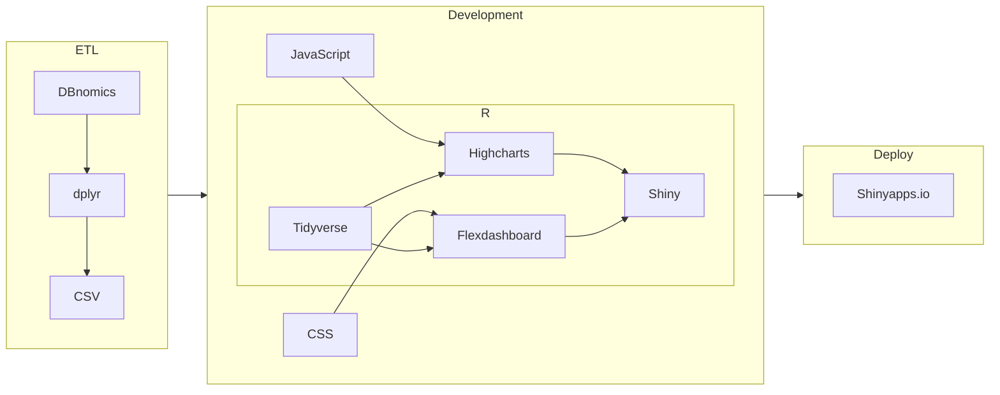

# ⚽Macro Copa

A dashboard to compare macroeconomic indicators of the 2022 World Cup
countries.

ShinyApp link: <https://schoulten.shinyapps.io/macrocopa/>

## Index

- [About](#about)
- [Data](#data)
- [Technical details](#technical-details)
- [Installation/replication](#installationreplication)
- [Next steps](#next-steps)

## About

This dashboard is an intersection between economics and soccer, taking
advantage of the 2022 World Cup event as its theme. The main idea of the
dashboard is to allow the user to **quickly compare the economic
performance of two participating countries** in the competition.

**Key features**:

- Interactive charts;
- Button to select pairs of countries for comparison;
- Button to select macroeconomic variables for comparison (GDP,
  inflation rate, interest rate, unemployment rate, exchange rate);
- Button for interactive time filter;
- Button to select chart type (line, column, or area);
- Button for data download.

## Data

The data comes from the [World Bank](https://www.worldbank.org/), using
the [World Development Indicators
(WDI)](https://datatopics.worldbank.org/world-development-indicators/)
dataset, and is described below:

| Variable      | Description                                              | Source           |
|---------------|----------------------------------------------------------|------------------|
| GDP           | Annual growth, %                                         | World Bank (WDI) |
| Unemployment  | Total, % of total labor force, national estimate, annual | World Bank (WDI) |
| Inflation     | Consumer prices, %, annual                               | World Bank (WDI) |
| Interest rate | Deposit, %, annual                                       | World Bank (WDI) |
| Exchange rate | Official, LCU per US\$, period average, annual           | World Bank (WDI) |

## Technical details

This project was built using several technologies and the development
process is summarized in the flowchart below.



- **ETL**: to extract, transform, and load the data, we used the
  [DBnomics](https://db.nomics.world/) database, which provides a data
  API for various sources, including World Bank. The process was
  developed using the R language, and a CSV file with the data was
  generated at the end.

- **Dashboard development**: we used
  [Flexdashboard](https://pkgs.rstudio.com/flexdashboard/) and
  [Shiny](https://shiny.rstudio.com/) together to structure the HTML
  page with a template and add interactivity and buttons to the
  dashboard, using CSS and JS when necessary for customization.
  Additional data manipulations were made with
  [Tidyverse](https://tidyverse.tidyverse.org/), and the graphics were
  generated with [Highcharts](https://www.highcharts.com/).

- **Deploy**: to publish the dashboard, we used the
  [Shinyapps.io](https://www.shinyapps.io/) service from Posit.

Finally, we used [`renv`](https://rstudio.github.io/renv/) for project
dependency (package) management, and all the tools used are open source
and free.

## Installation/replication

To replicate this ShinyApp, follow these steps:

1.  Clone the repository (terminal):

<!-- -->

    git clone https://github.com/schoulten/macrocopa.git

2.  Open the RStudio project (macrocopa.Rproj file).

3.  Restore the project dependencies (R Console):

``` r
renv::restore()
```

4.  Run the ShinyApp locally (R Console):

``` r
rmarkdown::run()
```

You should obtain a screen similar to this as a result:


## Next steps

- [ ] Fix CSS for country titles (H1 element)
- [ ] Add GitHub Action to automate ETL and deploy
- [ ] Refactor for more functional code
- [ ] Optimize for mobile interfaces
